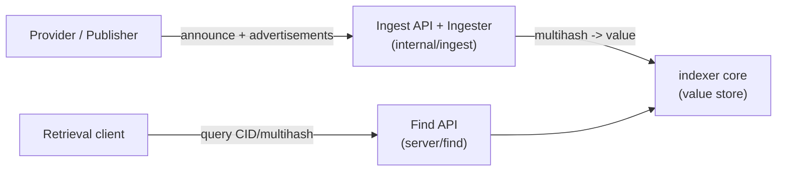

# AGENTS.md

Guidance for AI agents working in the storetheindex repository. Read this
before making changes, and keep it accurate as the code evolves.

## What this project is

storetheindex is an IPNI (InterPlanetary Network Indexer) implementation. It
ingests content advertisements published by storage providers and serves
content routing queries that map a CID/multihash to the provider(s) that have
it. It runs as a daemon exposing find, ingest, and admin HTTP APIs, and also
includes the assigner service used to distribute ingestion load across a pool
of indexers.

Entry point: [`main.go`](main.go) wires up the CLI commands in
[`command/`](command). The daemon is started by
[`command/daemon.go`](command/daemon.go), which constructs the value store,
registry, ingester, and HTTP servers.

## Build, test, lint

Use the `Makefile` targets:

```sh
make build      # go build
make test       # go test ./...
make vet        # go vet ./...
make lint       # golangci-lint run
make all        # vet + test + build
```

Notes:

- Go version is pinned in [`go.mod`](go.mod) (currently `go 1.26`).
- Prefer running the specific package tests you touched (e.g.
  `go test ./internal/ingest/...`) for fast feedback, then `go test ./...`
  before finishing.
- Some tests use race detection heavily around concurrency; when changing
  concurrent code, run with `-race`.
- The repo root contains a prebuilt `storetheindex` binary and a `.local-config`
  directory used for local runs; do not commit changes to those.

## Repository structure

Top-level modules (all under module `github.com/ipni/storetheindex`):

| Path | Purpose |
| --- | --- |
| [`main.go`](main.go) | CLI entry point. |
| [`command/`](command) | CLI commands: `daemon`, `admin`, `assigner`, `gc`, `init`, `loadgen`/`loadtest`, `log`, `updatemirror`, plus shared flags. |
| [`config/`](config) | Config file schema, defaults, load/save, upgrade. One file per section (`ingest.go`, `discovery.go`, `indexer.go`, `finder.go`, etc.). |
| [`internal/ingest/`](internal/ingest) | Advertisement ingestion: subscriber wiring, workers, ad-chain processing, entry/HAMT/CAR indexing, CAR mirror. See [doc/ingestion.md](doc/ingestion.md). |
| [`internal/registry/`](internal/registry) | Provider registry: known providers, allow/publish policy, freeze state, auto-sync scheduling, live sync status. |
| [`internal/registry/policy/`](internal/registry/policy) | Allow/publish policy evaluation. |
| [`internal/freeze/`](internal/freeze) | Disk-usage monitoring and freezer (frozen mode). |
| [`internal/metrics/`](internal/metrics) | OpenCensus metrics and the metrics/pprof server. |
| [`internal/httpserver/`](internal/httpserver) | Shared HTTP helpers (method checks, JSON responses, errors). |
| [`server/find/`](server/find) | Find (query) HTTP API: `/cid/`, `/multihash/`, `/providers`, `/providers/`, `/stats`, `/health`. |
| [`server/ingest/`](server/ingest) | Ingest HTTP API: `/announce`, `/register`, `/health`. |
| [`server/admin/`](server/admin) | Admin HTTP API: sync, import, freeze, reload-config, etc. |
| [`server/carmirror/`](server/carmirror) | Serves CAR mirror files to other indexers. |
| [`carstore/`](carstore) | CAR file reader/writer used by the mirror. |
| [`filestore/`](filestore) | File storage abstraction (local filesystem and S3). |
| [`gc/`](gc) | Garbage collection (`reaper`) for removed/expired index data. |
| [`admin/`](admin) | Admin API client and models. |
| [`assigner/`](assigner) | Assigner service: assigns publishers to indexers, handles freeze handoff. Has its own `command/`, `config/`, `core/`, `server/`. |
| [`peerutil/`](peerutil) | Peer ID policy helpers. |
| [`rate/`](rate) | Ingest rate tracking. |
| [`fsutil/`](fsutil) | Filesystem helpers (path expansion, disk usage). |
| [`scripts/`](scripts) | Operational and test scripts. |
| [`test/`](test) | Shared test helpers and load tests. |
| [`doc/`](doc) | Design and reference documentation. |
| [`deploy/`](deploy) | Kubernetes/kustomize manifests. |

Key external dependencies:

- `github.com/ipni/go-libipni` - `dagsync` (DAG synchronization + announce),
  advertisement/find/ingest schemas and models. Ingestion is built on
  `dagsync.Subscriber`.
- `github.com/ipni/go-indexer-core` - the value store engine (`engine.New`) that
  holds `multihash -> value` mappings.
- `github.com/libp2p/go-libp2p` - libp2p host and gossipsub.
- `github.com/ipld/go-ipld-prime`, `go-ipld-adl-hamt`, `go-car` - IPLD data
  handling.

These sibling repos are often checked out next to this one (see the go-libipni,
go-indexer-core, indexstar, etc. paths in the workspace). When behavior depends
on `dagsync`, consult the go-libipni source.

## High-level data flow



- Ingestion writes mappings into the indexer core. This is the write path and
  the most performance-sensitive part of the system.
- Find reads from the indexer core. In multi-indexer deployments, an external
  Indexstar service fans queries out to all indexers and merges results.

## Ingestion documentation (keep in sync)

Detailed ingestion behavior is documented in
[doc/ingestion.md](doc/ingestion.md). This is a required companion to the
ingestion code.

Rules for agents:

- The source code is always the source of truth. If `doc/ingestion.md`
  disagrees with the code, trust the code and fix the doc.
- Whenever you modify the ingestion process - anything under
  [`internal/ingest/`](internal/ingest), the ingest server
  ([`server/ingest/`](server/ingest)), the sync/registry integration in
  [`internal/registry/`](internal/registry) that affects ingestion, or the
  ingestion configuration in [`config/ingest.go`](config/ingest.go) - update
  [doc/ingestion.md](doc/ingestion.md) in the same change.
- Whenever you read the ingestion code and notice that behavior has drifted from
  what [doc/ingestion.md](doc/ingestion.md) describes (regardless of whether you
  are the one changing it), update the doc to match the code.
- Keep the file map, diagrams, and config list in that document consistent with
  reality (function names, key prefixes, defaults, endpoints).

Other design docs worth reading:

- [doc/scaling-design-for-ingest.md](doc/scaling-design-for-ingest.md) -
  assigner, frozen mode, handoff, scatter/gather queries.
- [doc/config.md](doc/config.md) - config file location and reloadable items.
- [doc/creating-an-index-provider.md](doc/creating-an-index-provider.md) -
  provider/advertisement model.

## Conventions

- Standard Go style; run `make vet` and `make lint`. Fix any lints you
  introduce.
- Logging uses `github.com/ipfs/go-log/v2`; each package defines a package-level
  `log` logger with a namespaced name (e.g. `indexer/ingest`).
- Metrics use OpenCensus (`go.opencensus.io/stats`) via
  [`internal/metrics`](internal/metrics).
- Comments should explain intent and non-obvious constraints, not restate the
  code. Do not add narrating comments.
- Config: prefer adding options to the relevant `config/*.go` struct with clear
  doc comments and defaults in the section's `New*` constructor and
  `populateUnset`. Note in the doc comment whether a value is reloadable.
- Concurrency: ingestion has strict invariants (see
  [doc/ingestion.md](doc/ingestion.md)). Preserve per-publisher and per-provider
  serialization when changing worker or sync logic, and test with `-race`.

## Making changes safely

- Only commit when explicitly asked.
- Do not modify git config, and avoid destructive git operations.
- Do not commit secrets, the local `.local-config`, or the checked-in binary.
- When touching ingestion, update [doc/ingestion.md](doc/ingestion.md) as
  described above.
