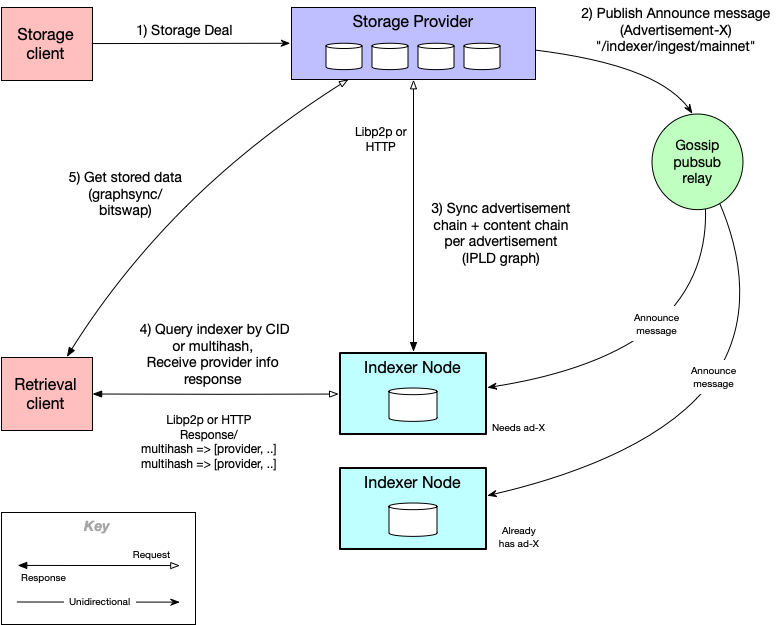

# About the Indexer

## Overview
An indexer is a network node that stores mappings of content multihahses to provider data records.  A client that wants to know where a piece of information is stored can query the indexer, using the CID or multihash of the content, and receive a provider record that tells where the client can retrieve the content and how to retrieve it.

### Indexer Ecosystem

## Terminology
- **Advertisement**: A record available from a publisher that contains, a link to a chain of multihash blocks, the CID of the previous advertisement, and provider-specific content metadata that is referenced by all the multihashes in the linked multihash blocks.  The provider data is identified by a key called a context ID.
- **Announce Message**: A message that informs indexers about the availability of an advertisement.  This is usually sent via gossip pubsub, but can also be sent via HTTP.  An announce message contains the advertisement CID it is announcing, which allows indexers to ignore the announce if they have already indexed the advertisement.  The publisher's address is included in the announce to tell indexers where to retrieve the advertisement from.
- **Context ID**: A key that, for a provider, uniquely identifies content metadata.  This allows content metadata to be updated or delete on the indexer without having to refer to it using the multihashes that map to it.
- **Gossip Pubsub**: Publish/subscribe communications over a libp2p gossip mesh. This is used by publishers to broadcast Announce Messages to all indexers that are subscribed to the topic that the announce message is sent on. For production publishers and indexers, this topic is `"/indexer/ingest/mainnet"`.
- **Indexer**: A network node that keeps a mappings of multihashes to provider records.
- **Metadata**: Provider-specific data that a retrieval client gets from an indexer query and passed to the provider when retrieving content.  This metadata is used by the provider to identify and find specific content and deliver that content via the protocol (e.g. graphsync) specified in the metadata. 
- **Provider**: Also called a Storage Provider, this is the entity from which content can be retrieved by a retrieval client.  When multihashes are looked up on an indexer, the responses contain provider that provide the content referenced by the multihashes.  A provider is identified by a libp2p peer ID.
- **Publisher**: This is an entity that publishes advertisements and index data to an indexer.  It is usually, but not always, the same as the data provider. A publisher is identified by a libp2p peer ID.
- **Retrieval Client**: A client that queries an indexer to find where content is available, and retrieves that content from a provider. 
- **Sync** (indexer with publisher):  Operation that synchronizes the content indexed by an indexer with the content published by a publisher.  A Sync in initiated when an indexer receives and Announce Message, by an administrative command to sync with a publisher, or by the indexer when there have been no updates for aprovider for some period of time (24 hours by default).
