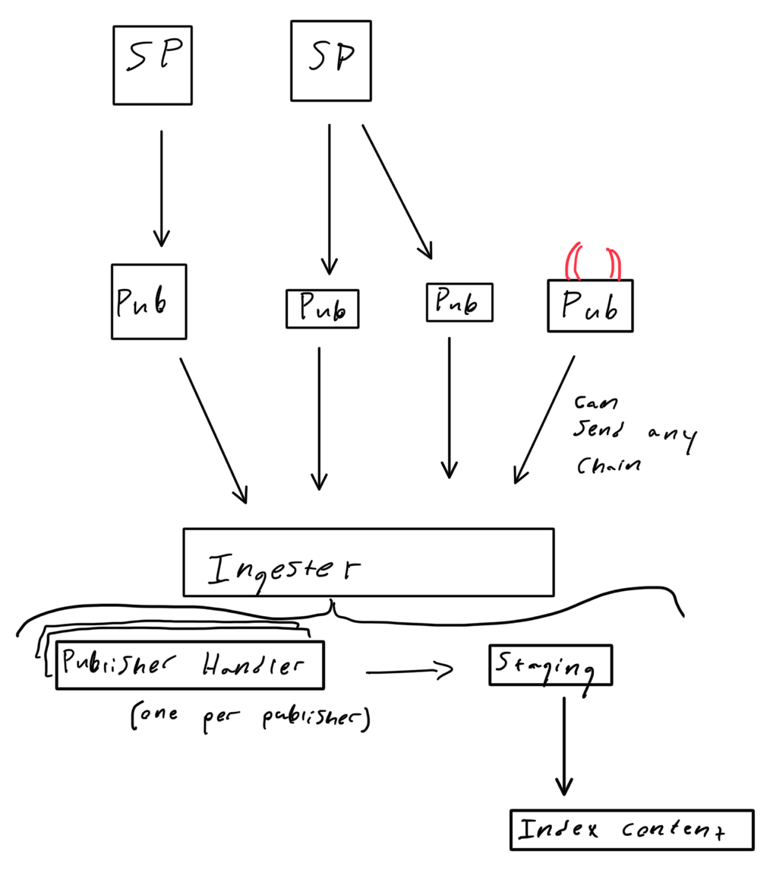
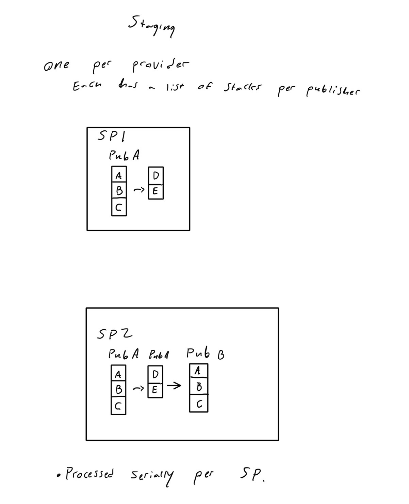

# Proposal for a new Ingest design

## Current Problems

1. Not resilient to process death.
2. Half the logic is in storage writer the other half in a block hook.
3. Undefined behavior if multiple publishers sync the same chain.
4. Relies of a chain of blocking channels to reverse the order of graphsync.
5. not linear execution flow.

The indexer semantics are relatively simple, yet the ingester may fail in
surprising and hard to reason about ways. The goal of this proposal is to
outline a design for an alternate ingester that upholds the indexer semantics
while being easy to reason about.

## Overview of the network

The indexer ingests data from publishers. There can be one publisher per
provider or many publishers per provider. Additionally there can be faulty or
malicious publishers that can point to other chains.

* This means we shouldn't assume a 1:1 relationship with a publisher and a
provider.

## Constraints of the indexer

1. If a an Ad is applied all older ads this ad references have also been
   applied. For example, given some chain `A <- B <- C`, the indexer will never
   be in the state that it indexed `A & C` but not `B`.
2. An indexer will index an Ad chain, but will not make any gaurantees about
   consistency in the presence of multiple ad chains for a given provider. For
   example if a provider publishes two ad chains at the same time chain1 and
   chain2 the indexer will apply whichever chain it learns about first first,
   then apply the other chain.
3. An indexer will not index the same Ad twice.
4. An indexer will be resilient to restarts. If the indexer goes down and comes
   back up it should not break constraint 1.

## Proposal

1. Introduce a new concept called "staging". An advertisement chain is put into
   the staging area after it is synced but before the chain is indexed.
2. Each *provider* has its own staging area.
3. The staging area is persisted.
4. Advertisements are processed serially by a single worker per provider.
5. A handler, which represents a single publisher, will write to an intermediate
   in memory stack (via `StorageWriteOpener`[0]) as it discovers ads from a sync.
   * If a chain contains multiple providers, each provider will have it's own
     stack.[1]
   * If the ad has already been processed (by checking the datastore), then we
     don't add it to the stack and stop traversing to earlier ads (because of
     constraint 1).
6. When the handler's sync is finished it moves the stack(s)[2] into each
   provider's staging area _before_ updating the latestSync state. It will also
   trigger a worker to start processing ads for the provider(s).
7. The staging area is represented as a list of stacks of Ads that need to be
   processed. One staging area per provider.
8. To make progress on the staging area a worker:
   1. Picks the stack at the head of the list (the first thing put in the
      staging area).
   2. In the stack, pop the stack (last ad put on the stack) and process it
     (by fetching the ad's referenced entries and indexing them). Repeat until
     stack is empty.
   3. Remove the head from the staging area.
   4. Repeat 1 -> 3 with the rest of the list.

## Benefits

* Core processing work happens in a simple serial fashion.
* If the indexer goes down, the staging area is persisted and a worker can
  resume where it left off.
* When an ad is in the main datastore it has actually been processed.
* No assumption is made that there is a 1:1 publisher:provider relationship.

[0]: It will also write to a namespaced datastore to persist the advertisement.
    So that if the indexer restarts we don't have to refetch this advertisement
    to process it.

[1]: Nothing prohibits an ad chain from being signed by one provider in one ad
     and another in the previous ad. Simple example, I make a valid advertisement
     for my provider, by accident or malice, I point my previous ad to another ad
     chain.

[2]: Note the stack will also include some metadata such as which publisher
     provided this stack, so that a worker can fetch the entries from this
     publisher as well.