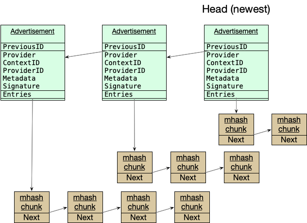

# Providing Data to a network indexer

There are two parts to the ingestion / providing protocol used by store the index.

1. Advertisements maintains an immutable authenticated data structure where providers describe what content they are have available.
2. Announcements are a transient notification that the content on a provider has changed.

## Advertisements

### Advertisement data structures and construction

Index content is an IPLD graph. The indexer reads the advertisement chain starting from the head, reading previous advertisements until a previously seen advertisement, or the end of the chain, is reached. The advertisements and their entries are then processed in order from earliest to head.



Multihash data is “paginated” by downloading blocks (chunks) of multihashes. These chunks are linked together using IPLD links.

An individual advertisement is an [IPLD](https://ipld.io/docs/data-model/) object with the following [schema](https://github.com/ipni/go-libipni/blob/main/ingest/schema/schema.ipldsch):
```
type Advertisement struct {
    PreviousID optional Link
    Provider String
    Addresses [String]
    Signature Bytes
    Entries Link
    ContextID Bytes
    Metadata Bytes
    IsRm Bool
    ExtendedProvider optional ExtendedProvider
}
```

* The `PreviousID` is the CID of the previous advertisement, and is empty for the 'genesis'.
* The Provider is the `peer.ID` of the libp2p host providing the content.
* The Addresses are the multiaddrs to provide to clients in order to connect to the provider.
  * The provider addresses in the indexer are always updated by the latest advertisement received.
* Entries is a link to a data structure that contains the advertised multihashes.
* ContextID is an identifier used to subsequently update or delete an advertisement. It has the following semantics:
  * If a ContextID is used with different entries, those entries will be _added_ to the association with that ContextID
  * If a ContextID is used with different metadata, all previous CIDs advertised under that ContextID will have their metadata updated to the most recent.
  * If a ContextID is used with the `IsRm` flag set, all previous CIDs advertised under that ContextID will be removed.
* Metadata represents additional opaque data that is returned in client query responses for any of the CIDs in this advertisement. It is expected to start with a `varint` indicating the remaining format of metadata. The opaque data is send to the provider when retrieving content for the provider to use to retrieve the content. Storetheindex operators may limit the length of this field, and it is recommended to keep it below 100 bytes.
* If ExtendedProvider is specified, indexers which understand the `ExtendedProvider` extension should ignore the `Provider`, `Addresses`, and `Metadata` specified in the advertisement in favor of those specified in the `ExtendedProvider`. The values in the direct advertisement should still be set to a compatible endpoint for content routers that do not understand full `ExtendedProvider` semantics.
* `Extendedprovider` is not valid for an `IsRm` advertisement. It should be ignored if specified.

#### Entries data structure

The Entries data structure can be one of the following:
* an interlinked chain of `EntryChunk` nodes, or
* an [IPLD HAMT ADL](https://ipld.io/specs/advanced-data-layouts/hamt/spec), where the keys in the map represent the multihashes and the values are simply set to true.

##### `EntryChunk` Chain
The `EntryChunk` chain is defined as the following schema:

```
type EntryChunk struct {
    Entries [Bytes]
    Next optional Link
}
```

The primary `Entries` list is the array of multihashes in the advertisement.
If an advertisement has more CIDs than fit into a single block for purposes of data transfer, they may be split into multiple chunks, conceptually a linked list, by using `Next` as a reference to the next chunk.

In terms of concrete constraints, each `EntryChunk` should stay below 4MB,
and a linked list of entry chunks should be no more than 400 chunks long. Above these constraints, the list of entries should be split into multiple advertisements. Practically, this means that each individual advertisement can hold up to approximately 40 million multihashes.

##### HAMT
The HAMT must follow the IPLD specification of [HAMT ADL](https://ipld.io/specs/advanced-data-layouts/hamt/spec).
The HAMT data structure is [used as a set](https://ipld.io/specs/advanced-data-layouts/hamt/spec/#use-as-a-set) to capture the list of multihashes being advertised.
This is where the keys in the HAMT represent the multihashes being advertised, and the values are simply set to `true`.

#### Metadata

The reference provider currently supports Bitswap and Filecoin protocols. The structure of the metadata format for these protocols is defined in [the library](https://pkg.go.dev/github.com/ipni/go-libipni/metadata).

The network indexer nodes expect that metadata begins with a `uvarint` identifying the protocol, followed by protocol-specific metadata. This may be repeated for additional supported protocols. Specified protocols are expected to be ordered in increasing order.

* Bitswap
  * `uvarint` protocol `0x0900` ([`TransportBitswap`](https://github.com/multiformats/multicodec/blob/master/table.csv#L133) in the multicodec table).
  * no following metadata.
* filecoin graphsync
  * `uvarint` protocol `0x0910`  ([`TransportGraphsyncFilecoinv1`](https://github.com/multiformats/multicodec/blob/master/table.csv#L134) in the multicodec table).
  * the following bytes should be a cbor encoded struct of:
    * PieceCID, a link
	* VerifiedDeal, boolean
    * FastRetrieval, boolean
* http
  * the proposed `uvarint` protocol is `0x3D0000`.
  * the following bytes are not yet defined.

#### ExtendedProvider

The `ExtendedProvider` field allows for specification of provider families, in cases where a provider operates multiple PeerIDs, perhaps with different transport protocols between them, but over the same database of content.

```
type ExtendedProvider struct {
    Providers [Provider]
    Override bool
}

type Provider struct {
    ID String
    Addresses [String]
    Metadata optional Bytes
    Signature Bytes
}
```

* If `Metadata` is not specified for a `Provider`, the metadata from the encapsulating  `Advertisement` will be used instead.
* If a `Provider` listing is written with no `ContextID`, those peers will be returned for all advertisements published by the publisher.
  * If `Override` is set on an `ExtendedProvider` entry on an advertisement with a `ContextID`, it indicates that any specified chain-level set of providers should not be returned for that context ID. `Providers` will be returned Instead.
  * If `Override` is not set on an entry for an advertisement with a `ContextID`, it will be combined as a union with any chain-level `ExtendedProvider`s (Addresses, Metadata).
  * If `Override` is set on `ExtendedProvider` for an advertisement without a `ContextID`, the entry is invalid and should be ignored.
* The `Signature` for each of the `Providers` within an `ExtendedProvider` is signed by their corresponding private key.
  * The full advertisement object is serialized, with all instances of `Signature` replaced with an empty array of bytes.
  * This serialization is then hashed, and the hash is then signed.
  * The `Provider` from the encapsulating advertisement must be present in the `Providers` of the `ExtendedProvider` object, and must sign in this way as well. It may omit `Metadata` and `Addresses` if they match the values already set at the encapsulating advertisement. However, `Signature` must be present.
* Note: the `Signature` of the top level `Advertisement` is calculated as before - it should not include the `ExtendedProvider` field for backwards compatibility. The Additional secondary signature from the same `Provider` in `ExtendedProvider` ensures integrity over the full message.

### Advertisement transfer

There are three ways that the provider advertisement chain can be made available for consumption by network indexers.

1. As set of files fetched over libp2phttp. This is the default for ipnisync.
2. As a set of files fetched over HTTP.
3. As a [graphsync](https://github.com/ipfs/go-graphsync) endpoint on a libp2p host. Support for this is ending soon.

There are two parts to the transfer protocol. The providing of the advertisement chain itself, and a 'head' protocol for indexers to query the provider on what it's most recent advertisement is.

#### Libp2p + HTTP

On libp2p hosts, HTTP is served over libp2p.

* HTTP is configured as a multiprotocol in the libp2p host.
* A publisher registers a HTTP request handler with a known IPNI path.
* HTTP requests sent over libp2p, and matching the handler's path, are handled by the publisher's handler.
* The publisher handles requests for a `head` resource or a CID resource.
  * Requests for `head` return information about advertisement chain including the latest CID.
  * Requests for a CID return the advertisement data or multihash entries block correcponding to that CID.

An implementation of the core ipnisync advertisement publisher is available as [ipnisync/publisher](https://pkg.go.dev/github.com/ipni/go-libipni/dagsync/ipnisync#Publisher). This is used to build the full provider implementation available in [index-provider](https://github.com/ipni/index-provider).

#### HTTP

The IPLD objects of advertisements and entries are represented as files named as their CIDs in an HTTP directory. These files are immutable, so can be safely cached or stored on CDNs.

The `head` protocol is the same as above, but not wrapped in a libp2p multiprotocol.
A client wanting to know the latest advertisement CID will ask for the file named `head` in the same directory as the advertisements/entries, and will expect back a signed response for the current head.

An implementation of the core HTTP content advertisement publisher is available as [ipnisync/publisher](https://pkg.go.dev/github.com/ipni/go-libipni/dagsync/ipnisync#Publisher). This used to build the full provider implementation available in [index-provider](https://github.com/ipni/index-provider).

#### Libp2p with Legacy data-transfer/graphsync

On older libp2p hosts, graphsync may still be used for providing the advertisement chain.

* Graphsync is configured on the common graphsync multiprotocol of the libp2p host.
* Requests for index advertisements can be identified by
    * The use of a ['dagsync'](https://pkg.go.dev/github.com/ipni/go-libipni/dagsync/dtsync#Voucher) voucher in the request.
    * A CID of either the most recent advertisement, or a a specific Entries pointer.
    * A selector either for the advertisement chain, or for an entries list.

An implementation of the core graphsync content advertisement publisher is available as [dtsync/publisher](https://pkg.go.dev/github.com/ipni/go-libipni/dagsync/dtsync#Publisher). This is used to build the full provider implementation available in [index-provider](https://github.com/ipni/index-provider).

On publisher hosts, a custom `head` multiprotocol is exposed on the libp2p host as a way of learning the most recent current advertisement.
The multiprotocol is named `/legs/head/<network-identifier>/<version>`. The protocol itself is implemented as an HTTP TCP stream, where a request is made for the `/head` resource, and the response body contains the string representation of the root CID.

## Announcements

Indexers may be notified of changes to advertisements as a way to reduce the latency of ingestion, and for discovery / registration of new providers.
Once indexers observe a new provider, they should adaptively poll the provider for new content, which provides the basis of understanding what content is currently available.

The indexer will maintain a policy for when advertisements from a provider are considered valid. An example policy may be
* A provider must be available for at least 2 days before its advertisements will be returned to clients.
* If a provider cannot be dialed for 3 days, it's advertisements will no longer be returned to clients.
* If a provider starts a new chain, previous advertisements now no longer referenced will not be returned after 1 day of not being referenced.
* If a provider cannot be dialed for 2 weeks, previous advertisements downloaded by the indexer will be garbage collected, and will need to be re-synced from the provider.

There are two ways that a provider may proactively alert indexer(s) of new content availability:

1. Gossipsub announcements boradcast to all indexers subscribed to a pubsub topic
2. HTTP announcements sent directly to one or more specific indexers

Both of these methods send a [`Message`](https://pkg.go.dev/github.com/ipni/go-libipni/announce/message#Message) to the indexer to announce the availability of a new advertisement. This message contains the CID of the head and the multiaddrs (libp2p and/or HTTP) of the host where the advertisement can be fetched from.

The dagsync publishers operate independently of announcement senders. Any announcement sender can send announcements for either a HTTP or libp2p pbulisher, or both. Announcements are send using the [`Sender`](https://pkg.go.dev/github.com/ipni/go-libipni/announce#Sender) instances that are configured. These Senders can consist of both [p2psender](https://pkg.go.dev/github.com/ipni/go-libipni/announce/p2psender) broadcast sender and [httpsender](https://pkg.go.dev/github.com/ipni/go-libipni/announce/httpsender) direct sender types.

### Gossipsub

When an announce `Message` is sent over gossip pub-sub, the topic is `/indexer/ingest/<network>`. For our production network, this is `/indexer/ingest/mainnet`. The message is send to all connected peers that are subscribed to the topic.

### HTTP

Alternatively, an announcement can be sent to a specific known network indexer.
The network indexer may then relay that announcement over gossip pub-sub to other indexers to allow broader discovery of a provider choosing to selectively announce in this way.

Announcements are sent as HTTP PUT requests to `/announce`] on the indexer node's 'ingest' server.
Note that the ingest server is not the same HTTP server as the primary publicly exposed query server, and these are bound to different TCP ports. This is because the index node operator may choose not to expose it, or may protect it so that only selected providers are given access to this endpoint due to potential denial of service concerns.

The body of the request put to this endpoint should be the json serialization of the announcement [`Message`](https://pkg.go.dev/github.com/ipni/go-libipni/announce/message#Message) that is otherwise provided over gossip pub-sub. It contains the head CID and the multiaddrs of where to fetch the advertisement chain.
