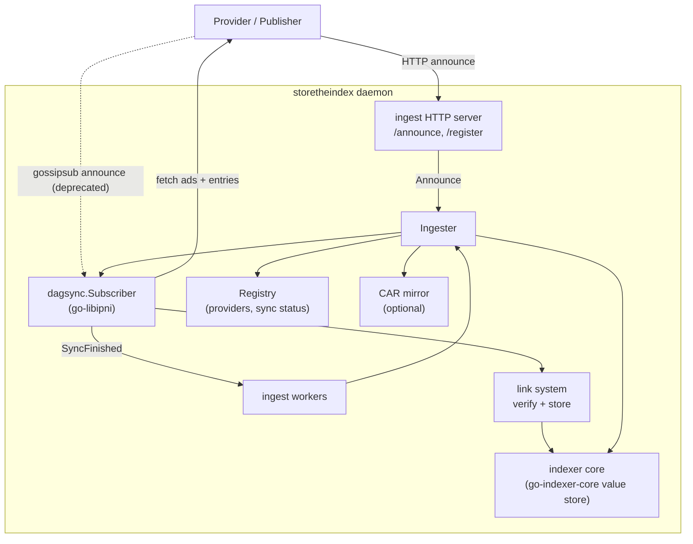
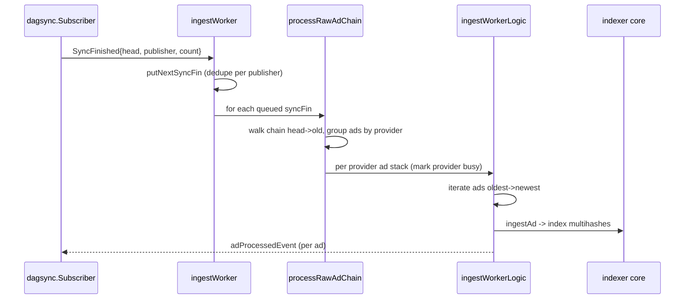
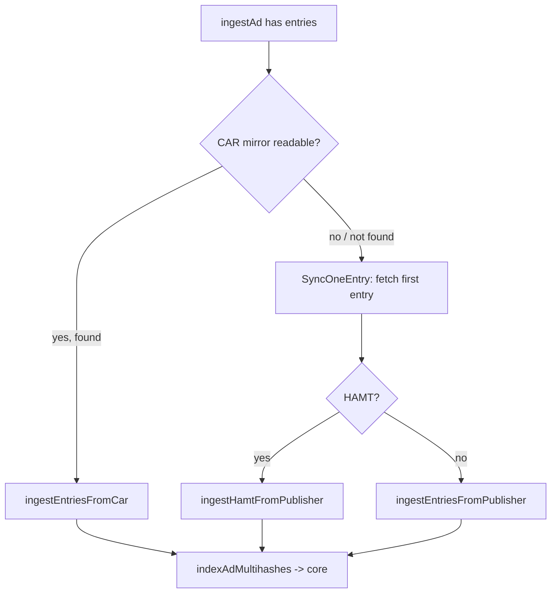
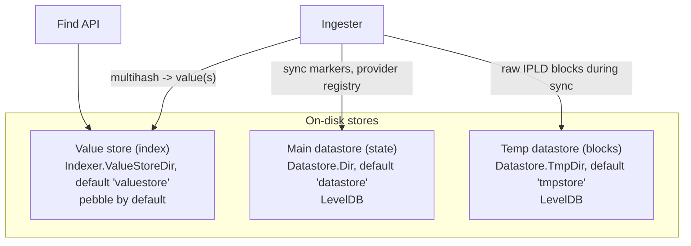

# Ingestion

This document explains how advertisement ingestion is currently implemented in
storetheindex. It is derived from the source code and must be kept in sync with
it. If you change ingestion behavior, or notice that this document disagrees
with the code, update this document (the source code is always the source of
truth).

Primary code:

- [`internal/ingest/ingest.go`](../internal/ingest/ingest.go) - Ingester, workers, ad-chain processing.
- [`internal/ingest/linksystem.go`](../internal/ingest/linksystem.go) - link system, advertisement verification, entry/HAMT/CAR ingestion, indexing.
- [`internal/ingest/mirror.go`](../internal/ingest/mirror.go) - CAR mirror read/write.
- [`internal/ingest/error.go`](../internal/ingest/error.go) - `adIngestError` classification.
- [`server/ingest/server.go`](../server/ingest/server.go) - `/announce` and `/register` HTTP endpoints.
- [`internal/registry/registry.go`](../internal/registry/registry.go) - provider registry, sync scheduling, sync status.
- [`config/ingest.go`](../config/ingest.go) - ingestion configuration.

## What ingestion does

An IPNI provider publishes a chain of signed **advertisements**. Each
advertisement references the previous one (`PreviousID`), forming a linked
list from newest (head) to oldest. Each advertisement either:

- adds content: carries a `ContextID`, `Metadata`, and an `Entries` link to a
  set of multihashes, or
- removes content: `IsRm` set for a `ContextID`, or
- updates metadata / provider addresses only (no entries).

The `Entries` link points to either:

- a chain of **EntryChunk** nodes (each holding a batch of multihashes and a
  `Next` link), or
- a **HAMT** (hash array mapped trie) whose keys are multihashes.

Ingestion is the process of discovering the ad chain, downloading the
advertisements and their entries, and writing the `multihash -> (provider,
contextID, metadata)` mappings into the indexer core value store so they can be
queried by the find API.

Synchronization of the DAGs (ad chain and entries) is done by the `dagsync`
package from `go-libipni` via a `dagsync.Subscriber`. storetheindex plugs its
own IPLD link system and block hook into the subscriber.

## Key components



- **Ingester** (`internal/ingest`): owns the subscriber, the worker pool, and
  the ad-chain processing logic. Constructed by `NewIngester`.
- **dagsync.Subscriber**: handles announce reception (direct HTTP via the
  ingest server; gossipsub subscription is still wired but deprecated), traverses
  and fetches DAGs over the ipni-sync (HTTP/libp2p) protocol, and emits
  `SyncFinished` events. Configured in `NewIngester`.
- **Registry** (`internal/registry`): tracks known providers, the allow/publish
  policy, freeze state, the auto-sync channel, and live sync status per
  publisher.
- **link system** (`mkLinkSystem` in `linksystem.go`): the IPLD storage
  read/write openers used by the subscriber. The write opener verifies
  advertisement signatures before storing and attributes downloaded bytes to
  the sync status.
- **indexer core** (`go-indexer-core` engine): the value store that holds the
  actual `multihash -> value` mappings and answers finds.
- **CAR mirror** (optional): stores advertisement + entry data as CAR files in
  a filestore (local or S3), and can serve as an alternate source for entries.

## Entry points that trigger ingestion

1. **Direct HTTP announce** (supported): `PUT /announce` (and
   `/ingest/announce`) on the ingest server. `Server.announce` validates the
   peer against the registry allow policy, skips if the announced CID equals
   the current latest sync, and calls `Ingester.Announce`, which forwards to
   `subscriber.Announce`. In assigner deployments, publishers send HTTP
   announces to the assigner, which forwards them to the assigned indexer.
2. **Gossipsub announce** (deprecated): the subscriber can still be configured
   with `dagsync.RecvAnnounce(cfg.PubSubTopic, ...)` to receive announce
   messages from a libp2p gossipsub topic. This path remains in the code for
   backward compatibility but is no longer the recommended way to deliver
   announcements. New deployments should use HTTP announces instead.
   Announcements received over pubsub are filtered by `reg.Allowed` and,
   optionally, by IP filtering.
3. **Auto-sync**: the registry emits `ProviderInfo` values on `SyncChan()` (for
   example on poll or handoff). `Ingester.autoSync` consumes these and starts a
   sync via `subscriber.SyncAdChain`.
4. **Explicit sync**: `Ingester.Sync` (invoked by admin API) syncs a specific
   provider, optionally with a depth limit and/or `resync`.

All of these ultimately drive the same `dagsync.Subscriber` and result in a
`SyncFinished` event that the workers process.

## Phase 1: Ad-chain sync ("scanning")

When a sync starts, the subscriber walks the advertisement chain from the head
toward the last-known-synced ad (the stop node), or until the configured depth
limit is reached.

The walk is **segmented**: `dagsync.SegmentDepthLimit(cfg.SyncSegmentDepthLimit)`
(default 2000) splits the traversal into segments. For each block (ad) visited,
the subscriber invokes storetheindex's block hook,
`Ingester.generalDagsyncBlockHook` (`ingest.go`):

- It loads the advertisement (`loadAd`). If loading fails, it fails the sync.
- It records scanning progress in the registry via `reg.RecordAdScanned` and
  logs every `adsScannedLogInterval` (100) ads.
- It sets the next CID to sync from `ad.PreviousID` (or `cid.Undef` at the
  chain start), which tells the segmented sync where to continue.

Important: dagsync collects the CIDs of a segment during the IPLD traversal and
calls the block hook for each **after** the segment's fetch completes (see
`walkFetch` in `go-libipni/dagsync/ipnisync/sync.go`). So scanning progress
advances in bursts at segment boundaries, not strictly per network round-trip.

During entry sync (Phase 3 below), the general block hook is overridden with a
`dagsync.ScopedBlockHook` so entry chunks are handled differently from
advertisements.

Advertisement blocks are stored via the link system write opener
(`mkLinkSystem`), which:

1. decodes the node,
2. if it is an advertisement, calls `verifyAdvertisement` (schema validation +
   signature verification); a bad signature aborts the exchange,
3. attributes downloaded bytes to the publisher's sync status if a byte counter
   is present in the context,
4. writes the block to the temporary datastore (`dsTmp`).

When the walk completes, the subscriber emits a `dagsync.SyncFinished` event
carrying the head CID, publisher peer ID, and the count of ads synced.

## Phase 2: Worker dispatch and grouping

`SyncFinished` events are delivered on the channel returned by
`sub.OnSyncFinished()`. A pool of `ingestWorker` goroutines
(`cfg.IngestWorkerCount`, resizable via `RunWorkers`) reads these events.



Per publisher, only one chain is processed at a time. `putNextSyncFin` /
`getNextSyncFin` maintain a per-publisher slot in `syncInProgress`: if a chain
is already being processed for a publisher, the new event replaces the queued
one, and the active worker keeps draining until the slot is empty.

`processRawAdChain` (`ingest.go`):

1. Walks the just-synced chain from head to older ads, loading each ad from the
   datastore. It stops early when it reaches an already-processed ad (which
   guarantees all older ads are already processed).
2. Groups ads by **provider** (`adsGroupedByProvider`). A single chain usually
   has one provider, but may contain several.
3. Tracks removals: an ad with `IsRm` records its `ContextID`; earlier
   (newer-in-walk) ads for a `ContextID` that is later removed are marked
   `skip`.
4. Records remove/non-remove ad-count metrics.
5. For each provider, ensures the provider is not already being ingested
   (`providersBusy`, to avoid double processing of the same provider from
   different publishers), marks it busy, and calls `ingestWorkerLogic`.

## Phase 3: Processing ads and ingesting entries

`ingestWorkerLogic` processes a provider's ad stack **oldest to newest**
(iterating the slice backwards) to preserve the invariant that processing an ad
implies all older ads are processed. For each ad:

- Skips ads already processed, or ads marked `skip` (deleted later in the
  chain) - the latter are still marked processed.
- Updates sync status (`SetCurrentAd`).
- Calls `ingestAd`, which classifies the ad (`linksystem.go`):
  - **Removal** (`IsRm`): removes the provider context from the indexer core;
    no entries fetched.
  - **Metadata / address update only** (no entries, or indexer frozen): writes
    the `indexer.Value` (or just updates addresses) without fetching entries.
  - **Content ad with entries**: proceeds to fetch and index entries.

For content ads, entry ingestion chooses a source:



- **CAR mirror** (`ingestEntriesFromCar`): if the mirror is readable and has
  the ad, entries are streamed from the CAR file and indexed. This avoids
  re-fetching from the publisher.
- **EntryChunk chain** (`ingestEntriesFromPublisher`): the first chunk is
  fetched via `SyncOneEntry` to detect the type, then the remaining chunks are
  synced with `SyncEntries` using a scoped block hook that indexes each chunk's
  multihashes (`indexAdMultihashes`) and deletes the chunk from the temp
  datastore as it goes.
- **HAMT** (`ingestHamtFromPublisher`): the whole HAMT is synced
  (`SyncHAMTEntries`), then keys (multihashes) are iterated and indexed in
  batches of 4096. HAMT CIDs are deleted from the temp datastore afterward.

`indexAdMultihashes` filters out invalid/too-short multihashes
(`MinimumKeyLength`) and calls the indexer core `Put` with the
`indexer.Value{ProviderID, ContextID, MetadataBytes}`.

After a content ad is processed successfully:

- The ad is marked processed (`markAdProcessed`), writing to `adProcessedPrefix`
  (and `adProcessedFrozenPrefix` when frozen).
- If a writable mirror is configured, the ad is written to a CAR file (or, if
  read from the same mirror, its temp data is cleaned up).
- An `adProcessedEvent` is sent on `inEvents`, which `distributeEvents` fans out
  to any `onAdProcessed` listeners (used by `Sync` to wait for completion).

Errors are classified by `adIngestError` (`error.go`). Permanent errors
(decoding, malformed, entry-chunk, content-not-found, and optionally a 500 on
the first entry when `Skip500EntriesError` is set) are logged and skipped.
Non-permanent errors bail out of the chain (later/older ads are not processed),
set the provider's last error, and record metrics.

## Storage

There are three distinct stores. Two are general-purpose key/value datastores
(`go-datastore`, backed by LevelDB), and one is the indexer core value store
that holds the actual index. They are created in
[`command/daemon.go`](../command/daemon.go) and configured by the `Datastore`
and `Indexer` config sections.



In summary: one store tracks local state, one holds the multihash-to-provider
mapping (the index), and one is a temporary block store used only during a sync.

### 1. Value store (the index)

The write target of ingestion and the read source of the find API. It is the
`go-indexer-core` engine created by `engine.New(valueStore, ...)`. It maps:

```
multihash -> []indexer.Value{ ProviderID, ContextID, MetadataBytes }
```

`indexAdMultihashes` calls `indexer.Put(value, mhs...)` to add mappings, and
removals call `RemoveProviderContext`. The backend is selected by
`Indexer.ValueStoreType`:

- `pebble` (default): local CockroachDB Pebble key-value store at
  `Indexer.ValueStoreDir` (default `valuestore`), tuned in `createValueStore`.
- `dhstore`: remote double-hashed store accessed over HTTP (reader-privacy
  deployments); nothing is stored locally.
- `memory`: in-memory, for testing.
- `relayx`: relayx-backed store.

The core engine may also front the value store with an optional in-memory result
cache (`radixcache`) sized by `Indexer.CacheSize`. How multihashes and values
are physically laid out (for example value/metadata de-duplication by context
ID) is an implementation detail of `go-indexer-core` and the chosen backend, not
of storetheindex.

### 2. Main datastore (`ds`) - local state tracking

A LevelDB datastore (`Datastore.Dir`, default `datastore`). It holds durable
indexer state, not index entries. Contents:

Ingestion markers (`ingest.go`):

- `syncPrefix` (`/sync/<publisherID>`) -> CID bytes of the latest fully
  processed ad for a publisher (`GetLatestSync` / `getLastKnownSync`).
- `adProcessedPrefix` (`/adProcessed/<adCid>`) -> marks an ad as processed
  (used to stop chain walks and skip re-processing).
- `adProcessedFrozenPrefix` (`/adF/<adCid>`) -> marks ads processed while
  frozen, used to roll back on unfreeze (`Unfreeze` / `removeProcessedFrozen`).

Registry state (`internal/registry/registry.go`):

- `/registry/pinfo/<providerID>` -> persisted `ProviderInfo`.
- `/assignments-v2` (and legacy `/assignments-v1`) -> assigner publisher
  assignments.
- sequence numbers used for register/announce replay protection.

Datastore bookkeeping (`command/datastore.go`):

- `/dsInfo/version` -> datastore schema version, migrated by `updateDatastore`.

Values here are small, per-key records (CID bytes, JSON-encoded provider info,
etc.). This store is not frozen-cleared and persists across restarts.

### 3. Temp datastore (`dsTmp`) - synced blocks

A LevelDB datastore (`Datastore.TmpDir`, default `tmpstore`). This is where the
dagsync link system writes blocks during a sync. It is a naive key/value store:

```
key   = CID.String()          (e.g. "baguqee...")
value = raw IPLD block bytes   (the encoded advertisement or entry chunk)
```

Both advertisements and entry-chunk/HAMT blocks are written here by
`mkLinkSystem`'s `StorageWriteOpener` and read back by `loadAd`/`loadNode` via
the read opener. There is no additional structure or index - lookups are by CID
key only. Entries are transient: entry chunks and HAMT nodes are deleted as they
are indexed, and an ad's block is removed once the ad is processed (or moved to
the CAR mirror if one is configured). `Datastore.RemoveTmpAtStart` wipes this
store on startup, and legacy data-transfer FSM records are cleaned up by
`cleanupDTTempData`.

Note: `dsTmp` is described as "temporary persisted data" - it survives a
restart (unless `RemoveTmpAtStart` is set) so an interrupted sync does not have
to refetch already-downloaded blocks, but its contents are expected to be
short-lived and safe to discard.

#### What populates `dsTmp`, and when

- **Phase 1 (ad-chain scanning):** the main source. As the subscriber walks the
  advertisement chain, every fetched advertisement block is written to `dsTmp`
  by `mkLinkSystem`'s `StorageWriteOpener`. `generalDagsyncBlockHook` and
  `processRawAdChain` then read these ads back via `loadAd` (which reads from
  `dsTmp`). An ad's block is removed once the ad is processed (or moved to the
  CAR mirror when one is writable).
- **Phase 3 (entry ingestion), fetching from the publisher:** entry-chunk and
  HAMT node blocks fetched by `SyncOneEntry` / `SyncEntries` /
  `SyncHAMTEntries` flow through the same write opener into `dsTmp`. These are
  deleted as they are indexed (entry chunks in `ingestEntriesFromPublisher`,
  HAMT nodes in `ingestHamtFromPublisher`'s deferred cleanup).
- **Phase 3, reading from the CAR mirror:** when a readable CAR mirror has the
  ad (`ingestEntriesFromCar`), entries are streamed from the CAR file and
  indexed directly, so entry blocks are **not** downloaded into `dsTmp` from the
  network. `dsTmp` is only written in this path when the data must be re-mirrored
  to a different writable mirror (`copyMirrorData`), in which case the first
  entry chunk and each subsequent chunk are put into `dsTmp` (keyed by CID) so
  the mirror writer can build the new CAR file.

In short, `dsTmp` is populated with advertisements during Phase 1 and, during
Phase 3, additionally with entries data - from the publisher in the normal case,
or from the CAR mirror only when re-mirroring.

## Concurrency model

- `IngestWorkerCount` worker goroutines pull `SyncFinished` events.
- Per publisher: at most one chain is processed at a time (`syncInProgress`).
- Per provider: at most one ingestion at a time across all workers
  (`providersBusy`) - protects against the same provider being published from
  multiple chains.
- `MaxAsyncConcurrency` bounds concurrent async syncs started by announces
  (enforced inside dagsync).
- **Scan/process sequencing:** after a successful ad-chain sync, dagsync blocks
  the next ad-chain sync for that publisher until the ingester calls
  `Subscriber.UnblockSync` after processing the queued `SyncFinished` event(s).
  Entry syncs (`SyncOneEntry`) are not gated. This prevents a new scan from
  contending with entry syncs for the same publisher on dagsync's per-publisher
  `syncMutex`.
- `distributeEvents` runs in its own goroutine, fanning ad-processed events out
  to `onAdProcessed` subscribers.

## Frozen mode

When the indexer is frozen (storage near capacity, see
[scaling-design-for-ingest.md](scaling-design-for-ingest.md)), ingestion
continues to process advertisements to keep provider/metadata state current,
but **does not fetch or index entries**. Content ads are treated as
metadata-only updates and ads are additionally recorded under
`adProcessedFrozenPrefix` so ingestion can resume from the right point if the
indexer is later unfrozen.

## Sync status tracking

The registry keeps a `syncTracker` per publisher (created lazily during
scanning) that records **per-phase** statistics. Each phase has at most one
ongoing run (`Scan`, `Processing`, `Download`) and a bounded history (up to 10
runs, newest first) in `ScanHistory`, `ProcessingHistory`, and `DownloadHistory`.
When a phase finishes, its run is moved directly into the corresponding history
array and cleared from the current slot. Trackers persist after a sync completes
so history remains visible until pruned by newer runs.

- **Scan** - ad-chain traversal. Fields include `AdsScanned`, `HeadAd`,
  `CurrentAd`, `StartTime`, `EndTime`, `Ongoing`, `Elapsed`, and `Error` when
  the scan failed. Started by `RecordAdScanned` (block hook). Ended by
  `EndScan` when a `SyncFinished` event is received, when `SyncAdChain` fails,
  or when the block hook fails a sync.
- **Processing** - applying advertisements. Fields include `AdsProcessed`,
  `AdsTotal`, `AdsLeft`, `CurrentAd`, `ErrorCount`, timing fields, and `Error`
  when processing bailed early. Started by `BeginProcessing` in
  `ingestWorkerLogic`. Ended by `EndProcessing` when the worker finishes (with
  an error on cancel or bail-early).
- **Download** - entry data fetch for the current processing run. Fields include
  `BytesDownloaded`, `EntryChunkCount`, `ChunkMultihashCount`,
  `HamtMultihashCount`, `MultihashCount`, timing fields, and `Error` when
  processing ended with an error. The first `SetDownloading` call after
  `BeginProcessing` starts one download run; later calls in the same processing
  run accumulate into that run. Updated via `AddChunk`, `AddHamtMultihashes`,
  and `AddBytes` (link system).

When a new run of a phase starts before the previous one was ended, the
previous run is archived defensively into that phase's history.

This status is exposed on the find HTTP API: `GET /sync/status` returns all
publisher statuses; `GET /sync/status/<publisherID>` returns one publisher's
status.

See [`internal/registry/syncstatus.go`](../internal/registry/syncstatus.go) for
the tracker and its JSON serialization.

## Advertisement ingestion invariants

From the `Ingester` doc comment (`ingest.go`):

1. If an ad is processed, all older ads (toward the start of the chain) are also
   processed. Given `A <- B <- C`, the indexer is never in a state where `A` and
   `C` are indexed but not `B`.
2. The indexer indexes an ad chain but makes no consistency guarantees across
   multiple concurrent chains for the same provider; whichever chain is learned
   first is applied, then the other.
3. The same ad is never indexed twice, and the indexer is resilient to restarts
   without breaking invariant 1.

## Configuration

Ingestion is configured by the `Ingest` section of the config file
([`config/ingest.go`](../config/ingest.go)). Key options:

- `AdvertisementDepthLimit` - max ads to sync across all segments (default large).
- `EntriesDepthLimit` - max entry chunks to sync across all segments.
- `FirstSyncDepth` - ad-chain depth on first sync with a new provider.
- `SyncSegmentDepthLimit` - segment size for segmented sync (default 2000; -1 disables).
- `IngestWorkerCount` - number of ingest worker goroutines (reloadable).
- `MaxAsyncConcurrency` - max concurrent async syncs (reloadable).
- `MinimumKeyLength` - minimum multihash digest length to index.
- `SyncTimeout` - max time for a single sync.
- `HttpSyncTimeout`, `HttpSyncRetryMax`, `HttpSyncRetryWaitMin/Max` - HTTP sync tuning.
- `Skip500EntriesError` - skip ads whose first entry sync returns HTTP 500 (reloadable).
- `AdvertisementMirror` - CAR mirror configuration.
- `ResendDirectAnnounce`, `OverwriteMirrorOnResync`.
- `PubSubTopic` - gossipsub topic for announce subscription (deprecated; kept
  for backward compatibility).

`SyncSegmentDepthLimit` and most sizing options apply at subscriber creation
(`NewIngester`) and require a daemon restart to change. The reloadable subset is
listed in [config.md](config.md).

## File map

| File | Responsibility |
| --- | --- |
| `internal/ingest/ingest.go` | Ingester, worker pool, announce/sync entry points, ad-chain grouping and processing, datastore markers, auto-sync, frozen unfreeze. |
| `internal/ingest/linksystem.go` | Link system (verify + store), `ingestAd`, entry/HAMT/CAR ingestion, `indexAdMultihashes`, node decoding helpers. |
| `internal/ingest/mirror.go` | CAR mirror read/write over the filestore. |
| `internal/ingest/error.go` | `adIngestError` states and helpers. |
| `server/ingest/server.go` | `/announce` and `/register` HTTP handlers. |
| `internal/registry/registry.go` | Provider registry, policy, freeze, auto-sync channel, sync status. |
| `internal/registry/syncstatus.go` | Live per-publisher sync status tracker. |
| `config/ingest.go` | Ingestion configuration and defaults. |
| `config/datastore.go` | Main and temp datastore configuration (dirs, types). |
| `command/datastore.go` | Datastore creation, versioning/migration, temp cleanup. |
| `command/daemon.go` | Wires up value store, main/temp datastores, registry, ingester. |
