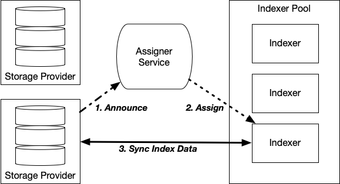

# Indexer Scaling Design for Ingest-heavy Workload

The eventual goal for indexer scale is 10^15^ indexes. This is not bytes of data stored, but rather the number of indexes stored. An index is a map of a CID to provider data. The actual amount of data is much greater. Currently we handle around 10^12^ indexes, and over that time we will progress toward the eventual scale goal in a number of steps.

The majority of indexing work is currently dominated by ingesting index data. The incoming data can be more than a single indexer can handle, both in rate and in quantity, and is rapidly increasing. So, the most immediate need to progress toward the scale goal is to handle the increasing ingestion load.

## Basic Requirements

- Must be able to add indexers at anytime to increase overall indexing capacity.
- Any indexer node must gracefully hand-over work when it reaches capacity, even from a single data source.
- Must support optional data redundancy within indexer pool, to tolerate loss of node(s).
- Must be able to send queries to all indexers and merge results into single response.

## Approach Overview: A Simple Strategy to Handle Index Ingestion

### Data Ingestion

Index data ingestion happens when an indexer receives an “announce” message announcing the availability of new index data advertisement(s) from a publisher, and in response, the indexer subsequently retrieves all index data that has not already been retrieved from the publisher. As the number of publishers increases, at some point a single indexer node will not be able to keep up with the rate at which new index data is published, and may not have sufficient storage on the node to store it all.

### Ingestion Work Distribution

Indexer scaling to handle the ingestion workload is based on a simple strategy of distributing ingestion over a pool of indexers, and is done in a way that allows nodes to be added as additional capacity is required, without needing to move data around to rebalance storage. This starts by assigning different content *publishers* to different indexer nodes, so that each node handles a separate portion of the ingestion work. An indexer node will handle the ingestion of all advertisements and multihash entries published by the publishers assigned to it.

When an indexer reaches its configured storage limit, it stops ingesting new index data, and other indexers in the pool resume ingesting data from the publishers assigned to the full indexer. More indexer nodes are added to the pool as more storage capacity and ingestion work distribution are needed. Consider each indexer node, in a pool of indexers, as a bucket of data from a set of publishers. When that indexer is full it overflows into other indexers. This can continue as long as there are more indexers available to continuing ingesting index data.

The three main components of this scalability strategy are:

- **Assigner Service**:  service that assigns publishers to indexers
- **Indexer Frozen Mode**: indexer operating mode where no new content is indexed
- **Handoff of publisher assignments**: re-assignment of publishers from frozen indexer, to active indexers, to resume indexing where frozen indexer stopped

### Pros and Cons of Scaling Strategy

Pros:

- Less syncing: no need for every indexer to sync with every publisher
- Metadata not duplicated to multiple indexers (as with key-sharding): metadata only on indexers handling provider.
- No data shared between indexers. They each manage their own publishers’ chains.
- No need to read advertisements only to check provider (as compared with provider sharding)
- Indexers can have different storage capacities.
- No need for consensus.
- Ingestion work can be redistributed without having to move data between indexers.

Cons:

- Uneven distribution: some publishers will index more data than others
- Scatter/gather queries are required: query duplicated to all indexers, responses merged into a single response to the client.
- Provider changing publisher can cause duplicate indexing (as opposed to provider sharding).
- Adding indexers has no effect until an existing indexer reaches storage limit.

### Distribution by Publisher

Different publishers are assigned to different indexes in a pool of indexers. Assignment means adding the publisher to an indexer’s allow list. An indexer will ingest index data from only the publishers in its allow list.

#### Not by Provider?

Indexing data is not sharded by provider, because knowing the provider requires reading an advertisement. That means every indexer would need to process every announce message and query the publisher for the advertisement indicated in the announce, just to see what provider the advertisement is for.

## Assigner Service

The Assigner Service (AS) is responsible for assigning publishers to the indexers in its configured pool of indexers. The AS runs as a single instance, for a pool of indexers, on the same network as the indexers it manages assignments for. An indexer may only be a member of one Assigner’s indexer pool.

In addition to assigning new publishers to indexers, the AS also detects when indexers have gone into “frozen” mode, and the AS is responsible for re-assigning the publishers from a frozen indexer to non-frozen indexers. The AS also republishes direct HTTP announcements over gossip pubsub, so that all indexers in the pool can receive them.

The AS is intended for use within a single private deployment due to a number of assumptions: that assignments can be made to any indexer, that the admin API of all indexers is on a private network or similarly protected, and that there is no established means or protocol for different parties to manage nodes being added to or removed from the pool.

### Assigning a Publisher to an Indexer

An AS listens for gossip-sub and direct HTTP messages announcing the availability of new advertisements. It reads the publisher from each message and then does the following:

1. Determines if the publisher is already assigned to the requires indexers, if not…
2. Selects candidate indexers (not already assigned the publisher, not in frozen mode) from its pool of indexers
3. Orders these candidates to prefer those with the fewest assignments
4. Assigns the publisher to a candidate indexer.
5. Gets response from assigned indexer to confirm or reject assignment.
6. May be assigned to multiple indexers depending on replication configuration. Assigning the publisher to candidate indexrs continues until the required number of assignments made, or until there are no more indexers that the publisher can be assigned to.

After assignment, a sync with the new publishers is started on the assigned indexers, and the indexers receive announcements from these publishers and handle ingestion themselves.

If indexers remain offline while the AS handles a publisher that needs assignment, the AS assumes that the publisher may already be assigned to an offline indexer. This prevents over-assignment due to indexers going offline temporarily.

The assignment is communicated to the chosen indexer via a request sent from the AS to the indexer on an administrative endpoint. It is assumed that the administrative endpoint is only available on the internal private network and would not be accessible to any unauthorized connection.

### No Persisted Assignment State

The AS does not persist any information about publisher assignments or indexer status. Instead the state is rebuilt by querying indexers at startup. This simplifies the operation of the AS by removing any need to manage persistent storage for it. The AS is outside the critical path for index data ingestion and provider lookup, and is only needed when a publisher needs to be assigned to an indexer. This also means there is not a single point of failure that will cause the loss of assignment information. The AS node can be destroyed and a new one started without any operational impact.

### State Recovered at Startup

On startup, the AS reads its configuration file which describes the indexers in the pool it controls. The AS then queries the publisher assignments from each indexer, to get the set of assigned publishers, and keeps this in memory. It also queries the status of each indexer to see which indexers are frozen and if their assigned publishers have already been handed off to other indexers. Once this is done, then the AS resumes assigning publishers to indexers. As assignments are made, the AS in-memory state is updated.

If any of the indexers in the AS pool are not online when the AS starts, the AS will retry querying any offline indexers on receiving an announce message with a publisher that needs assignment. 

### Assigner Service Offline

If the AS is offline, indexers continue handling announcements from the assigned publishers and ingesting index data. Announcements from unassigned publishers are ignored until the AS is back online. When the AS comes back online, it resumes processing announcements and making assignments. The next announcement from an unassigned publisher is assigned to an indexer, and the indexer syncs all index data from that publisher.

### Preset Assignment

The AS can be configured to assign specific publisher(s) to specific indexer nodes. The AS configuration contains a map of publisher ID to a list of indexer node IDs. If a publisher exists in this map, that publisher is assigned to only the indexers listed for it. The preset replication configuration determined how many of the preset indexers in that list to assign the publisher to. 

Although a publisher with preset indexer assignments is only assigned to the indexers in its preset list, other publishers will still be assigned to the indexers in a preset list, unless the “allow” policy specifies otherwise. If an indexer with preset assignments becomes frozen, the publishers with preset indexers and only reassigned to other indexers within the preset list.

### Preferred Assignment

An existing indexer may be placed into an indexer pool. When that happens, the indexer will have no initial assignments, but it may have index data from its previous operation outside the pool. When queried by the AS, the indexer will inform that AS that it already has data from certain providers. This results in the AS preferring to assign these publishers to the indexer if those publishers need assignment. 

### Indexer Pool

An indexer pool is a set of indexer nodes on the same network at a single deployment (e.g. at cid.contact), over which the workload of indexing is distributed. The indexers in the pool are configured to use an assigner service, and the AS has each indexer in its pool specified in the AS configuration file. There is only a single indexer pool associated with an assigner service.

All the indexer nodes in a pool should be on the same network, so there is no difference in locality or connectivity and it should make no difference which indexer a publisher is assigned to. If there is a need to put indexers in separate pools, for example to have one pool handle certain publishers and another pool handle other publishers, then each pool should have its own AS with the allow policy for that AS configured to only allow the desired publishers.

Indexers can be added or removed from a pool at any time by adding or removing the indexer from the AS pool configuration and restarting the AS.

#### Add Indexer to Pool

An indexer is added to the pool by updating the Assigner Service (AS) configuration with the new indexer pool configuration, and then restarting the AS. An indexer’s admin URL must be the one that the indexer’s admin API is listening on, and should be an address on a private network interface.

The indexer pool is a list of indexer information structures configured in the AS configuration file. Each indexer information tells the AS the admin API URL, the find API URL, the ingest API URL, and any peer IDs for preset assignments to that indexer.

#### Remove Indexer From Pool

An indexer is removed from the pool by removing it from the Assigner Service pool configuration, and then restarting the AS. When an indexer is removed, the AS will see that the assigned count for publisher(s) is less than the replication factor and will assign the publisher(s) to another additional indexer in the pool and start a sync. This results in the removed indexer’s assignments getting assigned to a new indexers and those publishers’ data being ingested from the beginning. For this reason, replacing an indexer should be done by first adding a new one and then removing the one being replaced, so that the publishers from the removed indexer are assigned to the empty replacement indexer, and not to other nodes in the pool.

To remove an indexer without having its assignments completely re-ingested by other indexers, first freeze the indexer administratively and allow its assignments to be handed off to other indexers, resuming ingestion from where the frozen indexer left off. Then remove the frozen indexer.

#### How Many Active (unfrozen) Indexes in Pool?

At a minimum, there should be as many active indexer nodes as required to meet the configured replication factor. Having this minimum means that a single indexer node will ingest data for all publishers, meaning the indexing load is not distributed. This is OK as long as the indexer node is able to keep up with the incoming data, but there will be nowhere to handoff publishers when an indexer enters frozen more. Generally it will be desirable to divide the total ingestion over different indexer nodes, requiring that more than the minimum nodes are active in the indexer pool. How many depends on the capacity of each node to ingest data. Some high-volume publishers may require their own nodes.

### Replication

The AS has a configurable [`Replication`](https://pkg.go.dev/github.com/ipni/storetheindex@v0.5.7/assigner/config#Assignment) value that determines how many indexers each publisher is assigned to. Setting this value greater than one provides redundancy of index content. With this, the loss or unavailability of an indexer does not result in the loss or unavailability of index data.

## Indexer Frozen Mode

When an indexer’s storage usage reaches its configured limit, [`FreezeAtPercent`](https://pkg.go.dev/github.com/ipni/storetheindex/config#Indexer) (default 90%), the indexer automatically enters “frozen” mode. This is a mode of operation where the indexer does not store any new index data, but still processes updates and deletions of index data. A frozen indexer will not accept any new publisher assignments.

Provider information is still updated to reflect that the indexer is still handling ads, but contains an additional “FrozenAt” and “FrozenAtTime” to give the advertisement CID ingested before the freeze and the time the indexer became frozen. Internally the indexer tracks where in the ad chain it has read for the purpose of ingesting update and removal ads. The indexer continues to respond to any queries for index data.

An indexer can also be manually frozen using its admin API to request a freeze. This may be done to stop ingestion until the indexer’s storage capacity is increased, or if using an AS, so that continued indexing can be taken over by other indexer nodes. An indexer may also be subsequently unfrozen.

Indexer frozen mode does not require the use of an AS, and is useful to automatically stop ingestion before storage is full and becomes unusable.

### Disk Usage Monitoring

Each indexer monitors its disk capacity. It reports this in log messages and maintains a disk usage percent metric for administrative monitoring and alerting. When the indexer is within 10% of the freeze limit, the log message changes to a warning. If the freeze limit is set at 90% usage, then the warning starts when the indexer is at or above 80% usage. When the indexer is within 2% of the freeze limit, a critical disk usage warning is logged. These log warnings are intended to give sufficient time to allow administrators to increase storage capacity before the indexer goes into frozen mode.

### Freeze Independent of Assigner

Indexer freezing is independent of an assigner service and is useful to stop ingestion from completely filling storage and making the indexer inoperable. If an indexer becomes frozen and is not using an assigner service, then there is no publisher handoff. The indexer stops ingestion and will remain frozen until its storage capacity is increased and it is configured to unfreeze. 

### Unfreeze

An indexer can be unfrozen by configuring its `UnfreezeOnStart` setting to `true` and restarting the indexer. The indexer will resume indexing from where it was frozen. This is generally not recommended when the indexer is part of an Assigner Service pool, since publishers that were handed off to other indexers will remain assigned to those indexers, and the AS will need to be restarted to see that an indexer has become unfrozen.

## Publisher Handoff

The AS periodically polls indexers, on a configurable interval, to check if any have become frozen. If the AS sees that an indexer has become frozen, then the AS does a handoff for each publisher that is assigned to the frozen indexer. A handoff is where a publisher is re-assigned to another indexer in such a way that the indexing continues on the active indexer where it left off on the frozen indexer. During handoff, the active indexer also gets provider and extended provider information from the frozen indexer. 

The AS makes the decision about which indexers to handoff a publisher to using the same logic as when deciding where to assign a new publisher. This is done separately for each publisher being handed off.

The AS does not count assignments on frozen indexers. If there is a replication factor of two and an indexer becomes frozen, then the replica count for the publishers assigned to the frozen indexer drops by one (after completing handoff). Completing handoff satisfies the replication factor since each publisher is assigned to another available indexer.

### Resuming Incomplete Handoff

The AS handles incomplete handoff by resuming the handoff process for any publishers assigned to a frozen indexer which have not been handed off to another indexer. Incomplete handoff my occur due to insufficient indexers to accept handoff, indexers being off-line, or the AS going offline before handoff is complete.

If there are no unfrozen indexers available to accept the handoff of a publisher, the AS keeps track of the incomplete handoff and tries to complete the process if offline indexers come back online.

At startup, the AS determines if any handoff is incomplete and tries to complete it. This allows handoff completion if more indexers are added to the indexer pool (requiring AS restart), or if the AS went offline while doing a handoff. 

### Publisher data spread across frozen and active indexers

If a publisher publishes ads A to Z and indexer-1 becomes full after ingestion of ad D, then indexer-1 is frozen and indexer-2 takes over and starts ingesting at E. Queries are sent to all frozen and active indexer nodes, so among them they can respond to queries for content from any of the ads A-Z.

Both indexer-1 and indexer-2 continue processing advertisements, but only indexer-2 stores new index data. Indexer-1 processes advertisements only to update and delete provider data. The frozen indexer-1 does not fetch any entries associated with the advertisements.

## Why Freeze Indexer

### Versus Moving Publisher Data

Freezing is done because it allows indexers of varying capabilities and storage capacities to be added to the indexer pool in increase indexing capacity without having to move any data from one indexer to another. Moving data could be incredibly slow and costly given the volume. Also, indexers do not need to share data since any single indexer is completely responsible for the data from a publisher assigned to it.

### Versus Increasing Storage

In most deployments, it will at some point become necessary or desirable to limit the amount of storage allocated to a single node, either due to infrastructure limitations or due to increasing storage and query times with a large amount of data, of due to cost of additional nodes versus additional storage. When this point is reached, the freeze-handoff mechanism allows indexing to continue on additional nodes.

Most indexers will run on infrastructure that allows increasing storage during run-time. If increasing storage is desirable over freezing then the warnings that are issued when an indexer is at or over 80% capacity should allow adequate time for an administrator to react and configure more storage. This level can be reconfigured to give sufficient advanced warning. To prevent file corruption and keep the indexer functioning, an indexer will always freeze before it reaches 100% capacity.

## Frozen indexer EOL

### Recovering space from frozen indexers

If a frozen indexer recovers enough storage from removals or other means, then the storage allocated to that node can be reduced. Eventually if the frozen indexer stores no more data, or the data that it does store is deemed too old to be relevant, then the frozen indexer can be removed and repurposed. In the future there may be a process for consolidating the storage from multiple frozen indexers into a single instance.

### Unfreezing an Indexer

If a frozen indexer regains sufficient to operate again, it can be manually “unfrozen”, by configuring the indexer to unfreeze at startup. The indexer will resume indexing, for each publisher, from the ad that was last processed before becoming frozen. Taking an indexer out of “frozen” mode, may result in resuming ingestion from publishers that are now assigned to other indexers, which could cause unnecessary duplication of index data. This decision is left to administrators.

## Scatter/Gather Queries

A content retrieval client does not know which provider(s) or publisher(s) supply content identified by CID/multihash, and so does not know what indexer(s) to query. So, all indexers must be queried and the results collected and merged into one response. The Indexstar service handles this. It receives all queries, relays these queries to all indexers in the indexer pool (query fanout), collects the results from all indexers, and then merges them into a single response. The final response is returned to the client. The total query response time is not more than the response time from the slowest indexer as these are done in parallel. If any indexer is too slow it is ignored, and circuit breaker logic prevents continuing to send queries to down indexers.

Although the query load on the internal network is multiplied by the number of nodes in the indexer pool, the queries are not expensive. They usually only look up one or a few multihashes having responses that are also small. So far, this is insignificant to the traffic generated by and work done for ingestion (with sustained rates of 20K to 60K writes per second at the time of writing). The final query result is cached (cache configuration depends on infrastructure) and so repeated queries are answered before they even reach the Indexstar service. Cache, built into the indexer, can also be enabled on each node.

Since the increased query load on the network is not yet sufficient to be a bottleneck, the current scaling strategy is not concerned with distributing the query load across multiple nodes. As the query load grows, eventually that will need to be addressed as well.

## Possible Next Steps

### Distribution of Query Load - sharding by keyspace

The eventual strategy for dealing with the indexer query load is to shard the indexers by keyspace using a [consistent hash](https://en.wikipedia.org/wiki/Consistent_hashing), while also keeping the publisher sharding in place. This will work by employing the publisher sharding already discussed, and having the nodes that are handling ingestion write ingested index data to another set of key-sharded indexer nodes.

#### Ingest Layer

The ingest layer handles announce messages, performs syncs, and tracks ads ingested from the publishers assigned to each indexer. The nodes in this layer do not store advertisement data, only ad tracking data. The ingested data is written to all the key-sharded nodes.

#### Query Layer

The query layer stores index data (mappings of multihash to provider data), with each node responsible for a separate portion of the multihash keyspace. A replication factor may apply here.

Queries are directed to the specific indexers that handle the keyspace for the multihash being queried by a load balancer. If a query contains multiple multihashes the results will need to be gathered into a single response.

The addition or removal of nodes requires key redistribution. Even though consistent hashing minimizes the keys that need to be redistributed, this could still be slow depending on the number of keys.

### When is this needed?

If a significant portion of every node’s CPU or I/O bandwidth is dedicated to handling queries, to the point that queries are being queued up and the average response time is too long, or ingestion cannot keep up with even a small number of publishers, then queries need to be distributed.

## Q & A

- Is it sufficient to decide which indexer to assign a publisher to based only on the number of publishers already assigned to indexers?
    - The primary reason to spread ingestion over different publishers is to distribute the work of ingestion. The amount of storage remaining does not factor into the decision since freeze-handoff will redistribute ingestion anyway. Other factors that affect the ability to concurrently handle ingestion, such as memory or CPU resources, are not that meaningful without knowing the activity level of the other assigned publishers.
- What happens if a provider changes to a different publisher that publishes the same ad chain?
    - If this happens then an indexer node will start ingesting the entire ad chain from the new publisher, even though another indexer already has that same provider’s ad chain. This is probably rare enough where it does not matter, but would effectively lead to over-assignment of publishers to indexers.
- If node A becomes frozen and hands off to node B, how is the system supposed to know that A is still required? If node A fails then another node will need to index for A’s publishers, because B does not have all the data.
    - The data on A is lost, and the replication factor should have been set to > 1 to avoid that.
- What if the old data on node A is no longer needed, how should node A be removed from the pool so that the AS does not think it needs to assign A’s publishers to other nodes?
    - Remove A without freezing it first. If new announces arrive for the publishers on A, then those will be assigned at that time, unless blocked by policy.
